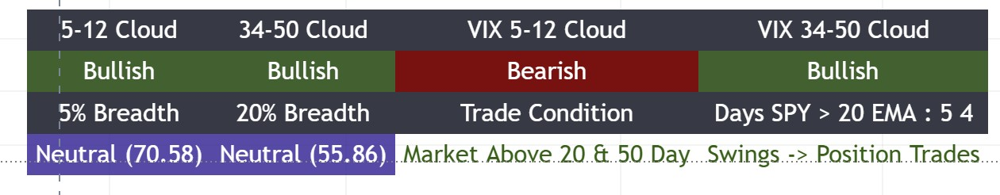

# Bottom Right Table - EMA Clouds & Market Breadth

## Overview
The Bottom Right Table provides comprehensive market timing and breadth analysis through EMA cloud indicators, VIX sentiment analysis, and SPY market condition assessment. This component helps traders determine:
- **Stock trend direction** (via EMA clouds)
- **Market sentiment** (via VIX clouds)
- **Market breadth extremes** (via breadth indicators)
- **Optimal trade timeframes** (via SPY analysis)



*Example of the Bottom Right Table showing EMA clouds, VIX clouds, market breadth indicators, and SPY analysis*

## Table Layout

### Top Section: EMA Clouds (Left) & VIX Clouds (Right)

#### Stock EMA Clouds (Left Side)
These clouds analyze the **stock's own trend** using a **10-minute timeframe**:

- **5-12 Cloud**: Short-term trend direction
  - **Bullish**: 5 EMA > 12 EMA (green background)
  - **Bearish**: 5 EMA < 12 EMA (red background)
  
- **34-50 Cloud**: Medium-term trend direction
  - **Bullish**: 34 EMA > 50 EMA (green background)
  - **Bearish**: 34 EMA < 50 EMA (red background)

**Usage**: 
- Both clouds bullish = strong uptrend
- Both clouds bearish = strong downtrend
- Mixed signals = choppy/transitional market

#### VIX EMA Clouds (Right Side)
These clouds analyze **market sentiment** using VIX on a **10-minute timeframe**:

- **VIX 5-12 Cloud**: Short-term fear/greed indicator
- **VIX 34-50 Cloud**: Medium-term fear/greed indicator

**Usage**:
- VIX clouds bullish (VIX rising) = Market fear increasing (contrarian bullish signal)
- VIX clouds bearish (VIX falling) = Market complacency (contrarian bearish signal)
- Use as contrarian indicator for market timing

### Bottom Section: Market Breadth & SPY Analysis

#### Market Breadth Indicators (Bottom Left)
Helps identify **market breadth extremes** for both short-term and mid-term analysis:

- **5% Breadth**: Percentage of stocks above their 5-day SMA
  - **GO (< 20)**: Oversold condition - good entry opportunity (green)
  - **Warning (> 75)**: Overbought condition - caution (red)
  - **Neutral**: Normal breadth conditions (purple)
  
- **20% Breadth**: Percentage of stocks above their 20-day SMA
  - **GO (< 30)**: Oversold condition - good entry opportunity (green)
  - **Warning (> 75)**: Overbought condition - caution (red)
  - **Neutral**: Normal breadth conditions (purple)

**Usage**:
- **Extreme Oversold**: Both breadth indicators in GO zone = potential market bottom
- **Extreme Overbought**: Both breadth indicators in Warning zone = potential market top
- **Divergences**: Stock making new highs while breadth declining = weakening market

#### SPY Market Condition (Bottom Right)
Helps determine **optimal trade timeframe** based on SPY's position relative to key moving averages:

**Trade Condition Display**:
- **Market Above 20 & 50 Day**: 
  - **Trade Type**: Swings → Position Trades
  - **Timeframe**: Longer holds (5-8+ days)
  - **Color**: Green
  
- **Market Above 50 Day**:
  - **Trade Type**: Swing trades
  - **Timeframe**: 5-8 day holds
  - **Color**: Green
  
- **Above 20 Below 50 Day**:
  - **Trade Type**: Short Swings
  - **Timeframe**: 1-2 day holds
  - **Color**: Red
  
- **Market Below 50 Day**:
  - **Trade Type**: Short Swings
  - **Timeframe**: 1-2 day holds
  - **Color**: Red

**Days SPY > 20 EMA**: 
- Shows consecutive days SPY has closed above its 20 EMA
- Higher count = stronger trend
- Resets to 0 when SPY closes below 20 EMA

**Days Since Low < EMA**:
- Tracks days since SPY's low was below its 20 EMA
- Helps identify recent pullback/retest patterns

## Technical Details

### EMA Cloud Calculations
```pinescript
// Stock EMAs on 10-minute timeframe
[ema5, ema12, ema34, ema50] = request.security(syminfo.tickerid, '10', 
    [ta.ema(close, 5), ta.ema(close, 12), ta.ema(close, 34), ta.ema(close, 50)])

// VIX EMAs on 10-minute timeframe
[vix_ema5, vix_ema12, vix_ema34, vix_ema50] = request.security('VIX', '10', 
    [ta.ema(close, 5), ta.ema(close, 12), ta.ema(close, 34), ta.ema(close, 50)])
```

### Market Breadth Calculations
```pinescript
// Percentage above 5-day SMA
percent_above_5 = request.security('NDFD', '1D', close)

// Percentage above 20-day SMA
percent_above_20 = request.security('S5TW', '1D', close)
```

### SPY Analysis
```pinescript
// SPY daily close and MAs
spy = request.security('SPY', 'D', close)
ma50 = ta.sma(spy, 50)
ma20 = ta.ema(spy, 20)

// Conditions
above_50_and_20 = spy > ma50 and spy > ma20
above_50 = spy > ma50
above_20 = spy > ma20
below_50 = spy < ma50
```

## Trading Applications

### Entry Timing
1. **Check Stock Clouds**: Both 5-12 and 34-50 bullish = favorable trend
2. **Check VIX Clouds**: Rising VIX (bullish clouds) = contrarian bullish signal
3. **Check Breadth**: Oversold breadth (< 20% on 5-day, < 30% on 20-day) = good entry
4. **Check SPY Condition**: Above 20 & 50 = longer holds possible

### Position Sizing
- **Strong Alignment**: All indicators bullish + SPY above both MAs = larger size
- **Mixed Signals**: Conflicting clouds or SPY below 50 = smaller size
- **Extreme Breadth**: Oversold breadth = potential for larger moves

### Trade Timeframe Selection
- **SPY Above 20 & 50**: Position trades (5-8+ days)
- **SPY Above 50 Only**: Swing trades (5-8 days)
- **SPY Below 50**: Short swings (1-2 days) or cash

### Risk Management
- **Cloud Reversals**: Stock clouds turn bearish = reduce exposure
- **Breadth Warnings**: Breadth > 75% = overbought, trim positions
- **SPY Breakdown**: SPY breaks below 50 SMA = defensive mode

## Best Practices

1. **Wait for Alignment**: Best setups when stock clouds, breadth, and SPY all align
2. **Use VIX as Contrarian**: Rising VIX (bullish clouds) often precedes market bottoms
3. **Monitor Breadth Extremes**: Oversold breadth + bullish clouds = high probability setup
4. **Respect SPY Condition**: Don't fight the market - adjust timeframe based on SPY position
5. **Track Days Above EMA**: Longer streaks = stronger trends = larger position sizes

## Configuration Options

### Display Toggles
- **Show Clouds**: Enable/disable the entire cloud table
- **Show Trend Labels**: Show/hide the EMA cloud labels
- **Show Market Breadth**: Show/hide breadth indicators (requires `show_clouds` enabled)

### EMA Lengths
- **Length for 5 EMA**: Default 5
- **Length for 12 EMA**: Default 12
- **Length for 34 EMA**: Default 34
- **Length for 50 EMA**: Default 50

### Visual Settings
- **Table Size**: Tiny, Small, Normal, or Large
- **Background Color**: Customizable table background
- **Text Color**: Customizable text color

## Request Call Efficiency
- **Total Calls**: 2 request calls
  1. Stock EMAs (4 values consolidated)
  2. VIX EMAs (4 values consolidated)
- **Breadth Data**: Uses TradingView custom symbols (NDFD, S5TW)
- **SPY Data**: Single daily request for SPY analysis

## Related Documentation
- [Main Dashboard Documentation](README.md)
- [21 EMA Structure Indicator](21ema-structure.md)
- [Top Right Table - Market Data Dashboard](top-right-table-dashboard.md)
