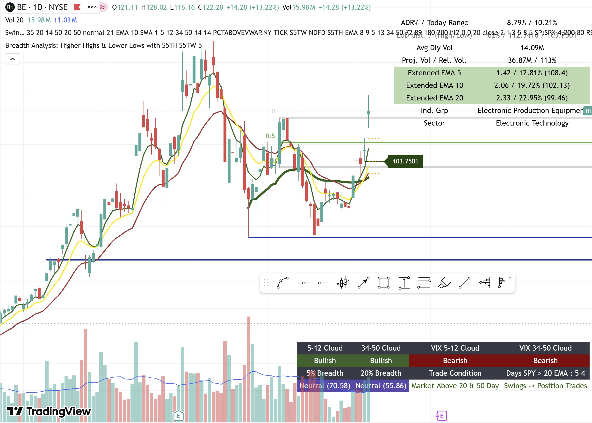

# Swing Dashboard - TradingView Script

> A comprehensive TradingView Pine Script indicator combining multiple trading tools into one powerful dashboard for swing traders.



*Complete overview of the Swing Dashboard showing all components and features*

---

## 🚀 Quick Start

1. **Copy** the script from `top-right-table`
2. **Paste** into TradingView Pine Editor
3. **Add** to your chart as an overlay indicator
4. **Customize** using the input settings

**Current Version**: 2.1 | **Pine Script**: v6 | **Request Calls**: 24 (optimized)

---

## 📋 What's Included

The Swing Dashboard is a **mashup** of multiple trading components. Click any component below for detailed documentation:

### Core Components

| Component | Description | Documentation |
|-----------|-------------|---------------|
| **21 EMA Structure** | Moving average structure with High/Close/Low MAs | [📖 Learn More](21ema-structure.md) |
| **Market Data Dashboard** | ADR%, ATR, Volume, Extended EMAs, Sector info | [📖 Learn More](top-right-table-dashboard.md) |
| **EMA Clouds & Market Breadth** | Stock/VIX clouds, breadth indicators, SPY analysis | [📖 Learn More](bottom-right-table-README.md) |

### Additional Features

| Feature | Description | Documentation |
|---------|-------------|---------------|
| **Ripster EMA Clouds** | 5-layer EMA cloud system for trend analysis | [📖 Learn More](ripster-ema-clouds.md) |
| **RS Rating System** | IBD-style relative strength rating (1-99) | [📖 Learn More](rs-rating-system.md) |
| **Pivot Points** | Daily pivot levels (R1, Pivot, S1, S2) | [📖 Learn More](pivot-points.md) |
| **RMV Indicator** | Range Movement Volatility for breakout detection | [📖 Learn More](rmv-indicator.md) |
| **Launch Pad Detection** | Consolidation zones before big moves | [📖 Learn More](launch-pad-detection.md) |
| **Inside Candle Patterns** | Weekly and intraday consolidation patterns | [📖 Learn More](inside-candle-patterns.md) |
| **Bollinger Bands** | Volatility-based support/resistance | [📖 Learn More](bollinger-bands.md) |
| **Extended EMA Analysis** | ATR and percentage distance from key MAs | [📖 Learn More](extended-ema-analysis.md) |
| **Floating Labels** | Dynamic right-side labels for key levels | [📖 Learn More](floating-labels.md) |

---

## 🎯 Key Features Overview

### Market Data Dashboard (Top Right Table)
- **ADR%** (Average Daily Range) with today's range
- **ATR** (Average True Range) measurements
- **Volume Analysis**: Average, Projected, Relative Volume
- **LoD Distance** (Low of Day from current price)
- **Extended EMA/SMA** measurements
- **Sector & Industry Group** information
- **Inside Candle** detection (30-min & weekly)

### 21 EMA Structure (v2.1 - NEW)
- **Three MA Lines**: High, Close, and Low moving averages
- **Timeframe Aware**: Auto-adjusts for Daily/Weekly charts
- **Trend Colors**: Center line changes color based on trend
- **Visual Cloud**: Gray fill between High and Low MAs
- **Bar Coloring**: Optional price-based bar colors
- **Default Display**: Enabled by default

### EMA Clouds & Market Breadth (Bottom Right Table)
- **Stock EMA Clouds**: 5-12 and 34-50 EMAs on 10-min chart
- **VIX EMA Clouds**: Market sentiment analysis
- **Market Breadth**: % above 5 SMA, % above 20 SMA
- **SPY Analysis**: Market condition for trade timeframe selection

---

## ⚙️ Configuration

### Basic Settings
- Toggle individual dashboard components on/off
- Adjust table sizes and colors
- Configure EMA/SMA lengths
- Set timeframe-specific settings

### MA Structure Settings
- **Daily MA**: Length (default: 21) and Type (EMA/SMA)
- **Weekly MA**: Length (default: 10) and Type (SMA)
- **Colors**: Customize High, Close (uptrend/downtrend), Low MA colors
- **Toggle**: Use custom colors or default gray
- **Bar Coloring**: Enable/disable price-based bar colors

---

## 📊 How to Use

### For Swing Trading
1. **Check Structure**: Look for pullbacks to 21 EMA structure
2. **Verify Volume**: Ensure volume confirmation on entries
3. **Check Breadth**: Use market breadth for timing
4. **SPY Context**: Use SPY analysis to determine trade timeframe
5. **RS Rating**: Focus on stocks with RS Rating > 70

### For Day Trading
1. **Pivot Points**: Use daily pivots for intraday levels
2. **LoD**: Previous day's low as support reference
3. **RMV**: Low RMV (< 10) indicates potential breakouts
4. **Inside Patterns**: Watch for inside candle breakouts

---

## 🔧 Requirements

- TradingView account with Pine Script v6 support
- Minimum plan supporting 24+ request calls
- Sufficient historical data for calculations

---

## 📈 Version History

### Version 2.1 (Current)
- ✅ Added MA Structure indicator (High/Close/Low MAs)
- ✅ Customizable colors with toggle option
- ✅ Default display enabled
- ✅ Timeframe-aware settings

### Version 2.0
- ✅ Optimized from 47 to 24 request calls
- ✅ Consolidated multiple requests
- ✅ Removed redundant Bollinger Band calculations
- ✅ Maintained all core functionality

---

## 🎓 Credits & Acknowledgments

### Original Script Credits
- **MikeC**: First version of the Swing Dashboard
- **Fred6724**: Contributions and RS Rating system
- **TheScrutiniser & GlinckEastwoot**: ADR% formula
- **Ripster47**: Original EMA Clouds + RSI script source

### MA Structure Credits
- **BalarezoCapital**: Original MA Structure concept
- **PrimeTrading**: Modifications and enhancements
- **Alex's Swing Trading System**: [PrimeTrading Academy](https://traderslab.gitbook.io/primetrading) - Inspiration for the 21EMA structure trading methodology

---

## 📁 File Structure

```
tv-script/
├── top-right-table              # Main script (all components)
├── bottom-right-table           # Standalone EMA Clouds component
├── README.md                    # Root README (points to docs)
└── docs/                        # Documentation folder
    ├── _config.yml              # Jekyll config for GitHub Pages
    ├── index.md                 # Main documentation page
    ├── README.md                # Detailed documentation
    ├── README.html              # HTML version of README
    ├── 21ema-structure.md       # 21 EMA Structure guide
    ├── top-right-table-dashboard.md # Market Data Dashboard guide
    ├── bottom-right-table-README.md # EMA Clouds & Breadth guide
    ├── ripster-ema-clouds.md    # Ripster EMA Clouds guide
    ├── rs-rating-system.md      # RS Rating guide
    ├── pivot-points.md          # Pivot Points guide
    ├── rmv-indicator.md         # RMV Indicator guide
    ├── launch-pad-detection.md  # Launch Pad guide
    ├── inside-candle-patterns.md # Inside Candle guide
    ├── bollinger-bands.md       # Bollinger Bands guide
    ├── extended-ema-analysis.md # Extended EMA guide
    ├── floating-labels.md       # Floating Labels guide
    └── TRADING_INSTRUCTIONS.md  # Trading instructions
```

---

## ❓ Troubleshooting

### Common Issues

**"Too many request calls" error**
- ✅ Ensure you're using Version 2.1 (24 calls)
- ✅ Disable unused components

**Compilation errors**
- ✅ Check Pine Script v6 syntax
- ✅ Verify all inputs are properly formatted

**Missing data**
- ✅ Ensure symbol has sufficient historical data
- ✅ Check timeframe settings

### Performance Tips
- Disable unused dashboard components
- Use appropriate timeframes
- Consider upgrading TradingView plan if needed

---

## 📚 Learn More

- **21 EMA Structure Methodology**: [PrimeTrading Academy](https://traderslab.gitbook.io/primetrading)
- **TradingView Pine Script**: [Official Documentation](https://www.tradingview.com/pine-script-docs/)

---

## 📄 License

Mozilla Public License 2.0 - See script header for full license terms.

---

**Need help?** Check the component-specific documentation pages linked above, or refer to the detailed [README.md](README.md).
