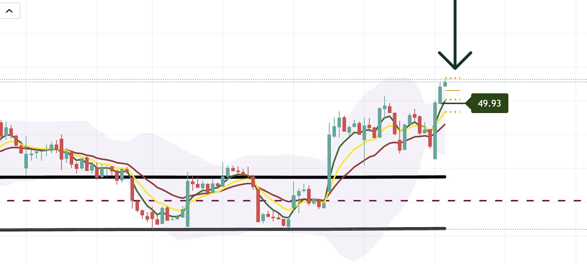

# Pivot Points System

## Overview
The Pivot Points system calculates and displays standard pivot point levels based on the previous day's high, low, and close prices. These levels act as dynamic support and resistance zones for intraday trading.



*Example of pivot points displayed on an hourly chart showing R1, Pivot, S1, and S2 levels as support/resistance zones*

## Pivot Levels

### Standard Pivot
- **Formula**: `(High[1] + Low[1] + Close[1]) / 3`
- **Display**: Orange solid line
- **Purpose**: Primary pivot level - acts as support/resistance

### Resistance Levels

#### R1 (Resistance 1)
- **Formula**: `2 * Pivot - Low[1]`
- **Display**: Orange dotted line
- **Purpose**: First resistance level above pivot

### Support Levels

#### S1 (Support 1)
- **Formula**: `2 * Pivot - High[1]`
- **Display**: Orange dotted line
- **Purpose**: First support level below pivot

#### S2 (Support 2)
- **Formula**: `Pivot - (High[1] - Low[1])`
- **Display**: Orange dotted line
- **Purpose**: Second support level below pivot

## Visual Display

### Lines
- **Pivot**: Solid orange line (width: 1)
- **R1, S1, S2**: Dotted orange lines (width: 2)
- **Length**: Extends 3 bars forward from current bar

### Floating Label
- **Location**: Right side of chart (offset configurable)
- **Content**: Shows all pivot levels with values
- **Format**: `R1: X.XXX \Pivot: X.XXX \S1: X.XXX \S2: X.XXX`
- **Color**: Orange background, white text

## Configuration Options

### Display Settings
- **Show Pivot Labels**: Toggle floating label display
- **Line Width**: Adjustable (default: 1)
- **Remove Floats**: Option to hide floating labels

### Visual Customization
- **Line Style**: Dotted for R1/S1/S2, solid for pivot
- **Line Color**: Orange (customizable in code)
- **Label Position**: Configurable offset from current bar

## Trading Applications

### Support/Resistance Levels
- **Pivot**: Acts as primary support/resistance
- **R1**: Resistance level for long entries
- **S1**: Support level for short entries
- **S2**: Stronger support level

### Breakout Trading
- **Price Above R1**: Bullish breakout signal
- **Price Below S1**: Bearish breakdown signal
- **Price Between Pivot and R1/S1**: Range-bound trading

### Intraday Trading
- **Morning Setup**: Use pivot levels for first hour trading
- **Range Trading**: Trade between S1 and R1
- **Breakout Trading**: Enter on breaks of R1 or S1

## Technical Details

### Calculation
```pinescript
// Previous day's data
highPrevDay = high[1]
lowPrevDay = low[1]
closePrevDay = close[1]

// Pivot calculation
pivot = (high[1] + low[1] + close[1]) / 3
r1 = 2 * pivot - low[1]
s1 = 2 * pivot - high[1]
s2 = pivot - (high[1] - low[1])
```

### Line Drawing
- Lines are drawn from current bar extending 3 bars forward
- Uses `line.new()` for dynamic line creation
- Previous lines are deleted before creating new ones

## Best Practices

1. **Daily Reset**: Pivot levels reset each day based on previous day's data
2. **Combine with Other Indicators**: Use with volume, EMA clouds, or structure
3. **Watch for Bounces**: Price often bounces off pivot levels
4. **Breakout Confirmation**: Wait for volume confirmation on breaks
5. **Multiple Timeframes**: Check pivot levels on different timeframes

## Related Documentation
- [Main Dashboard Documentation](README.md)
- [Top Right Table Dashboard](top-right-table-dashboard.md)

