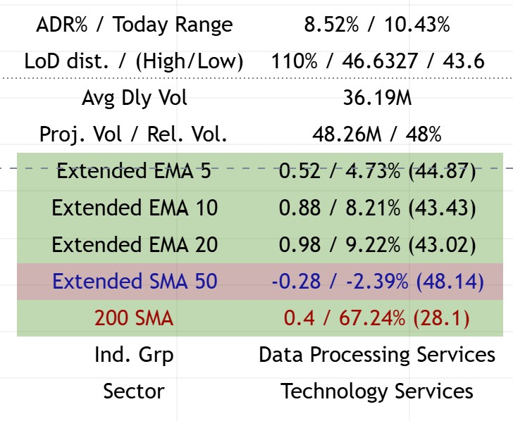
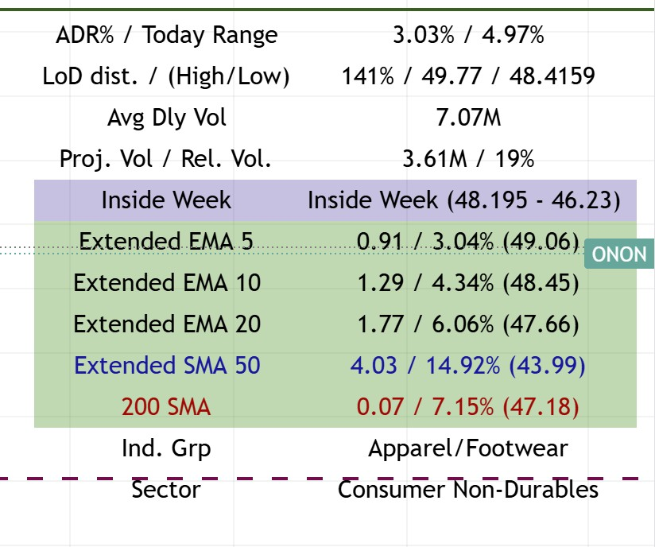

# Top Right Table - Market Data Dashboard

## Overview
The Top Right Table is the primary data dashboard displayed in the top-right corner of your TradingView chart. It provides comprehensive market data, volume analysis, extended EMA/SMA measurements, and fundamental information to help swing traders make informed decisions.



*Example of the Top Right Table showing market data, volume analysis, extended EMAs, and sector information*

## Components

### Market Data Metrics

#### ADR% / Today Range
- **ADR%**: Average Daily Range percentage over the specified period (default: 20 days)
- **Today Range**: Current day's range as a percentage
- **Purpose**: Helps identify volatility and expected daily movement
- **Usage**: Higher ADR% indicates more volatile stocks, useful for position sizing

#### LoD Distance / (High/Low)
- **LoD Distance**: Low of Day distance from current price, measured in ATR multiples
- **Yesterday High**: Previous day's high price
- **Yesterday Low**: Previous day's low price
- **Purpose**: Shows how far price is from the day's low and previous day's range
- **Usage**: Helps identify intraday support levels and potential reversal zones

#### Average Daily Volume
- **Avg Dly Vol**: Average daily volume over the specified period (default: 50 days)
- **Formatted**: Automatically converts to K (thousands), M (millions), or B (billions)
- **Purpose**: Identifies liquidity and institutional interest
- **Usage**: Higher volume = better liquidity and cleaner price action

#### Projected Volume / Relative Volume
- **Projected Volume**: Estimated end-of-day volume based on current pace
- **Relative Volume**: Current volume vs. average volume (percentage)
- **Purpose**: Identifies unusual volume activity
- **Usage**: 
  - Relative Volume > 100% = Above average volume (institutional interest)
  - Relative Volume < 100% = Below average volume (low interest)

### Extended EMA/SMA Analysis

The Extended section shows how far price has extended from key moving averages, measured in:
1. **ATR Multiples**: How many ATRs away from the MA
2. **Percentage**: Percentage distance from the MA
3. **MA Value**: Current value of the moving average

#### Extended EMA 5
- **Color Coding**: Green background when positive, red when negative
- **Shows**: Distance from 5-period EMA
- **Usage**: Short-term momentum indicator

#### Extended EMA 10
- **Color Coding**: Green background when positive, red when negative
- **Shows**: Distance from 10-period EMA
- **Usage**: Short-term trend extension

#### Extended EMA 20
- **Color Coding**: Green background when positive, red when negative
- **Shows**: Distance from 20-period EMA
- **Usage**: Medium-term trend extension
- **Note**: Can show "Pre" label when approaching earnings

#### Extended SMA 50
- **Color**: Blue text
- **Shows**: Distance from 50-period SMA
- **Usage**: Medium-term trend analysis
- **Display**: Only shows when `show_longer_ma` is enabled or when extension < 0.1

#### 200 SMA
- **Color**: Red text
- **Shows**: Distance from 200-period SMA
- **Usage**: Long-term trend analysis
- **Display**: Only shows when `show_longer_ma` is enabled or when extension < 0.1

### Additional Information

#### Sector & Industry Group
- **Sector**: Company's sector classification
- **Ind. Grp**: Industry group classification
- **Purpose**: Helps identify sector rotation and relative strength
- **Usage**: Compare sector performance to individual stock performance

#### Inside Week / Inside Candle Detection
- **Inside Week**: Detects when previous week was an inside week (high < prior high, low > prior low)
- **Inside Candle**: Detects inside candle patterns on specified timeframe (default: 30-min)
- **Purpose**: Identifies consolidation patterns that often precede breakouts
- **Color Coding**: Purple background when detected



*Example showing the Top Right Table with Inside Week pattern detected (purple background highlight)*

## Configuration Options

### Display Toggles
- **Show Market Cap**: Toggle market capitalization display
- **Show Float %**: Toggle float percentage display
- **Show ADR%**: Toggle ADR% and today's range
- **Show ATR**: Toggle ATR display
- **Show LoD dist.**: Toggle Low of Day distance
- **Show Avg Daily $ Volume**: Toggle dollar volume display
- **Show Avg Daily Volume**: Toggle volume display
- **Show Projected Volumes**: Toggle projected volume
- **Show Relative Volume**: Toggle relative volume
- **Show Extended**: Toggle extended EMA/SMA section
- **Show Sector**: Toggle sector display
- **Show Ind. Grp**: Toggle industry group display

### Extended EMA/SMA Settings
- **Extended EMA Input**: Which EMA to show extension from (default: 20)
- **Extended SMA Input**: Which SMA to show extension from (default: 50)
- **Show Longer MAs**: Enable display of 50 SMA and 200 SMA

### Visual Settings
- **Table Size**: Tiny, Small, Normal, or Large
- **Background Color**: Customizable table background
- **Text Color**: Customizable text color
- **Show Empty Row**: Add spacing above table to avoid overlap with pane icons

## Trading Applications

### Position Sizing
- **ADR%**: Use to determine position size based on volatility
- **Extended Distance**: Avoid buying when >1x ATR above 21dma structure
- **Volume**: Higher relative volume = stronger conviction

### Entry Timing
- **LoD Distance**: Shows if price is near daily low (potential support)
- **Extended EMAs**: Shows if price is extended (wait for pullback)
- **Inside Patterns**: Consolidation often precedes breakouts

### Risk Management
- **ATR**: Use for stop-loss placement
- **Extended Distance**: Larger extension = higher risk
- **Volume**: Low volume = less conviction = smaller position

## Technical Details

### Volume Calculations
```pinescript
// Relative Volume
relVol = vol / ta.sma(vol, len) * 100

// Projected Volume
volume_per_second = volume / time_passed
volume_projected = volume + volume_per_second * time_left
```

### Extended Calculations
```pinescript
// Extended in ATR multiples
extended_ema = (close - price_ema) / atr

// Extended in percentage
percent_change_from_ema = (close - price_ema) / price_ema * 100
```

### Inside Candle Detection
```pinescript
// Inside Week
isInsideWeekCandle = (prior_week_high < twoPriorWeekHigh and 
                      prior_week_low > twoPriorWeekLow)

// Inside Candle (configurable timeframe)
isInsideCandle = (twoPriorthirtyMinHigh >= prevThirtyMinHigh and 
                  twoPriorthirtyMinLow <= prevThirtyMinLow)
```

## Best Practices

1. **Monitor Relative Volume**: Look for stocks with Rel. Vol > 100% for institutional interest
2. **Check Extension**: Avoid entries when Extended EMA 20 > 1.0 ATR
3. **Watch Inside Patterns**: Inside weeks/candles often precede significant moves
4. **Use LoD Distance**: Helps identify intraday support levels
5. **Sector Context**: Compare stock performance to sector performance

## Related Documentation
- [Main Dashboard Documentation](README.md)
- [21 EMA Structure Indicator](21ema-structure.md)
- [Bottom Right Table - EMA Clouds & Market Breadth](bottom-right-table-README.md)

